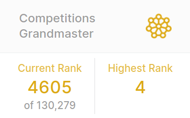

# Kaggle Competitions - Sample Code

This repo contains some of the code I've written for Kaggle's Machine Learning competitions in 2010-2016. 

During that time, I gained a Kaggle Competitions Grandmaster rating and was once ranked as the #4 competitor.
For more information about my work on Kaggle, see: https://www.kaggle.com/chefele
These competitions were certainly very educational & a lot of fun. 

## Competition Details

I need to fill in more details here, highlighting:
- Some particuarly interesting competitions (e.g. the Essay competition)
- Some particularly clear or clever pieces of code

Much of this code was written very quickly & used solely within the limited timeframe for each contest. 
As a result there are some clever bits, but also some messy and inefficient bits that I have not cleaned up. 

In total, for these competitions, I've written approximately:
- 45K lines of Python
- 26K lines of R
- 4K  lines of Java
- 3K  lines of bash

In addition, I've posted Kaggle 'kernels' code (https://www.kaggle.com/chefele/kernels), 
as well as some well-received comments and analyses in online discussions (https://www.kaggle.com/chefele/discussion). 

